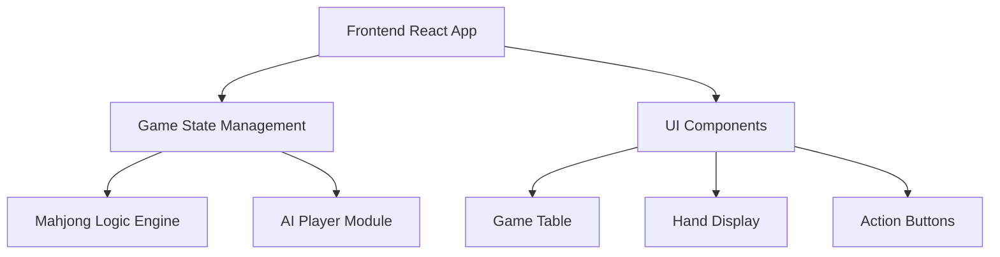
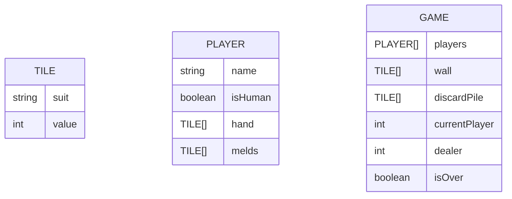

## 1. Architecture Design

## 2. Technology Description
- Frontend: React@18 + TypeScript + tailwindcss@3 + vite
- Initialization Tool: vite-init
- Backend: None (纯前端项目)
- Database: None

## 3. Route Definitions
| Route | Purpose |
|-------|---------|
| / | 游戏主页面 |
| /rules | 规则说明页面 |
| /settings | 设置页面 |

## 4. API Definitions (if backend exists)
本项目不涉及后端API

## 5. Server Architecture Diagram (if backend exists)
本项目不涉及后端服务器

## 6. Data Model (if applicable)

### 6.1 Data Model Definition

### 6.2 Data Definition Language
本项目不涉及数据库
