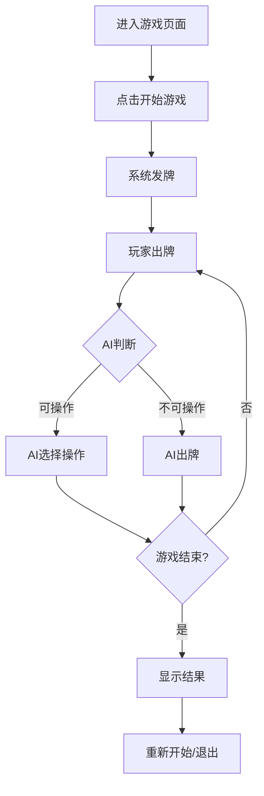

## 1. Product Overview
这是一个海南麻将小游戏，让用户可以与AI对手进行牌局，锻炼牌技。
- 主要功能：海南麻将规则实现、AI对手、用户界面和交互
- 目标：提供真实的麻将体验，帮助用户提升牌技

## 2. Core Features

### 2.1 User Roles (if applicable)
| Role | Registration Method | Core Permissions |
|------|---------------------|------------------|
| Player |无需注册|开始游戏、打牌、查看规则|

### 2.2 Feature Module
1. **游戏页面**：麻将牌桌、玩家手牌、出牌区域、操作按钮
2. **规则说明页面**：海南麻将规则介绍
3. **设置页面**：游戏难度、音乐开关等设置

### 2.3 Page Details
| Page Name | Module Name | Feature description |
|-----------|-------------|---------------------|
| 游戏页面 | 牌桌区域 | 显示四个玩家的手牌和牌堆 |
| 游戏页面 | 操作区域 | 吃、碰、杠、胡等操作按钮 |
| 规则说明页面 | 规则介绍 | 详细介绍海南麻将的玩法和规则 |
| 设置页面 | 游戏设置 | 调整AI难度、音效开关等 |

## 3. Core Process
用户进入游戏页面→点击开始游戏→系统发牌→玩家与AI轮流打牌→有人胡牌或流局→游戏结束并显示结果

## 4. User Interface Design
### 4.1 Design Style
- **主色调**：经典麻将桌绿色(#2d5a27)，搭配金色(#d4af37)点缀
- **按钮风格**：圆角按钮，带有轻微的3D效果
- **字体**：传统风格的字体，标题使用装饰性字体，正文使用清晰的 sans-serif
- **布局风格**：中央牌桌布局，玩家手牌在底部，AI玩家在其他三边
- **图标风格**：传统麻将风格的图标，使用适当的emoji增强趣味性

### 4.2 Page Design Overview
| Page Name | Module Name | UI Elements |
|-----------|-------------|-------------|
| 游戏页面 | 牌桌区域 | 绿色背景，中央为牌堆，四周为玩家区域 |
| 游戏页面 | 手牌区域 | 底部为玩家手牌，可点击选择和出牌 |
| 游戏页面 | 操作按钮 | 吃、碰、杠、胡等按钮，颜色醒目 |
| 规则说明页面 | 规则介绍 | 卡片式布局，分节展示规则 |
| 设置页面 | 游戏设置 | 开关控件、滑块控件、下拉菜单 |

### 4.3 Responsiveness
- Desktop-first设计，自适应不同屏幕尺寸
- 移动端优化触摸操作，按钮和牌的尺寸适合手指点击

### 4.4 3D Scene Guidance (if applicable)
本项目不涉及3D场景
